## Generating Ideas

**Troy-**

| Need                                                              | Feature                         | Detail                                                                                     |
|-------------------------------------------------------------------|---------------------------------|--------------------------------------------------------------------------------------------|
| The product provides accurate soil moisture readings. (explicit)  | Capacitive Soil Probe           | The device measures changes in the soil to estimate how much water is present.             |
|                                                                   | Soil Moisture Calibration Dial  | The device lets the user adjust the sensor to match known dry and wet soil conditions.     |
|                                                                   | Multi Depth Probe               | The device measures moisture at different depths to check how evenly the soil is watered.  |
|                                                                   | Analog to Digital Converter     | The device changes the sensor's electrical signal into data the microcontroller can read.  |
|                                                                   | Probe Temperature Compensation  | The device adjusts the moisture reading when temperature changes affect the sensor.        |

| Need                                                                | Feature                 | Detail                                                                                             |
|---------------------------------------------------------------------|-------------------------|----------------------------------------------------------------------------------------------------|
| The product provides accurate light intensity readings. (explicit)  | Photodiode              | The device produces a signal based on how much light reaches the sensor.                           |
|                                                                     | Lux Conversion Circuit  | The device converts the light sensor's signal into a light level measured in lux.                  |
|                                                                     | Light Diffusing Cover   | The device spreads light across the sensor to help prevent inaccurate readings from bright spots.  |
|                                                                     | Adjustable Sensor Gain  | The device changes the sensor's sensitivity so it can measure both low and high light levels.      |
|                                                                     | Ambient Light Shield    | The device blocks unwanted light from certain directions to improve the reading.                   |

| Need                                                                    | Feature                     | Detail                                                                                                |
|-------------------------------------------------------------------------|-----------------------------|-------------------------------------------------------------------------------------------------------|
| The product provides information that is easy to interpret. (explicit)  | Seven Segment Display       | The device shows measurements using easy to read numbers.                                             |
|                                                                         | Rotary Encoder              | The device lets the user switch between different plant measurements by turning a control.            |
|                                                                         | Status Indicator Bar        | The device shows the current condition of a measurement using a series of indicators.                 |
|                                                                         | Measurement Units Selector  | The device lets the user choose between different measurement units, such as Celsius and Fahrenheit.  |
|                                                                         | Threshold Indicator         | The device shows when a measurement is too low, acceptable, or too high.                              |

| Need                                                                             | Feature                 | Detail                                                                                  |
|----------------------------------------------------------------------------------|-------------------------|-----------------------------------------------------------------------------------------|
| The product provides consistent readings across repeated measurements. (latent)  | Averaging Algorithm     | The device combines several readings to create a more stable measurement.               |
|                                                                                  | Sensor Warm Up Routine  | The device gives the sensors time to stabilize before taking measurements.              |
|                                                                                  | Probe Position Guide    | The device helps the user place the probe at the same depth each time.                  |
|                                                                                  | Outlier Rejection       | The device removes unusual readings that are far different from the others.             |
|                                                                                  | Reference Resistor      | The device provides a stable electrical value to help keep sensor readings consistent.  |

| Need                                                            | Feature                   | Detail                                                                                     |
|-----------------------------------------------------------------|---------------------------|--------------------------------------------------------------------------------------------|
| The product maintains measurement accuracy over time. (latent)  | Auto Zero Function        | The device creates a new starting point for the sensor when needed.                        |
|                                                                 | Calibration Memory        | The device saves calibration settings so they are not lost when the device is turned off.  |
|                                                                 | Replaceable Sensor Probe  | The device allows worn sensors to be replaced without replacing the entire product.        |
|                                                                 | Self Diagnostic Routine   | The device checks for sensor problems that could cause inaccurate readings.                |
|                                                                 | Protective Probe Coating  | The device protects the probe from damage caused by long term contact with wet soil.       |

**Jacob-**

| Need                                                                            | Feature           | Detail                                                                                                      |
|---------------------------------------------------------------------------------|-------------------|-------------------------------------------------------------------------------------------------------------|
| The product should work reliably with different types of soil and growing media | Seismometer       | The device senses the density and stiffness of surrounding soil                                             |
|                                                                                 | Electrodes        | The device sends electrical signals through the soil to detect electric resistivity                         |
|                                                                                 | Soil penetrometer | The device senses the physical resistance to being inserted into different types of soil                    |
|                                                                                 | Soil sampler      | The device uses chemical analysis to determine soil composition                                             |
|                                                                                 | Database access   | The device is connected to a database that provides necessary care information based on measured soil types |

| Need                                                        | Feature         | Detail                                                                                   |
|-------------------------------------------------------------|-----------------|------------------------------------------------------------------------------------------|
| The product helps users determine when plants need watering | Moisture sensor | The device records the moisture level of the plant                                       |
|                                                             | LED             | The device will display different colors showing different levels of moisture            |
|                                                             | Buzzer          | The device emits audible sound to notify users the plant needs watering                  |
|                                                             | Color reader    | The device will compare the color of the plant to the expected level of hydration        |
|                                                             | Camera          | The device tracks pictures of leaves/flowers to determine health via wilting or drooping |

| Need                                  | Feature             | Detail                                                                             |
|---------------------------------------|---------------------|------------------------------------------------------------------------------------|
| The product delivers readings quickly | Pushbutton          | The device immediately delivers button-specific readings when the user pushes down |
|                                       | LCD                 | The device automatically lists the user-preferred top data readings                |
|                                       | Speaker             | The device audibly informs the user of the readings                                |
|                                       | Timer               | The device allows users to see how long readings take to display                   |
|                                       | Email notifications | The device updates users periodically via email on plant health                    |

| Need                                     | Feature      | Detail                                                                                                     |
|------------------------------------------|--------------|------------------------------------------------------------------------------------------------------------|
| The product monitors ambient temperature | Thermometer  | The device uses mercury to measure the temperature using mercury’s temperature-based expansion             |
|                                          | Thermistor   | The device records the ambient temperature as a function of semiconductor resistance                       |
|                                          | Thermocouple | The device records a difference in temperature by sensing the difference in voltage at two separate points |
|                                          | RTD          | The device measures temperature as a function of metallic resistance                                       |
|                                          | IR Sensor    | The device detects IR radiation at different surfaces to gather temperature data                           |

| Need                                                                        | Feature            | Detail                                                                                                 |
|-----------------------------------------------------------------------------|--------------------|--------------------------------------------------------------------------------------------------------|
| The product should provide enough information to support watering decisions | Tensiometer        | The device measures soil water tension                                                                 |
|                                                                             | Weight Scale       | The device tracks the weight of watered plants as water is put into and released from pot              |
|                                                                             | Float sensor       | The device tracks the height of the watering tank to determine if there is enough water to be released |
|                                                                             | Humidity sensor    | The device tracks humidity of outside gardens to determine if water is necessary                       |
|                                                                             | Water Tracking Log | The device tracks watering habits of the user and impact on the plant to predict watering necessity    |

**Herman-**

| Need | Feature | Detail |
|---|---|---|
| The product remains readable under typical outdoor lighting conditions. (explicit) | LED Display | The device screen lights up brightly using LED to provide a clear and highly visible screen. |
|  | Anti-Glare Screen Coating | Non reflective surface that diffuses sunlight glare. |
|  | High contrast colors. | High Contrast user interface colors. For example dark text on a light background on the screen. |
|  | Ambient Light Sensor | A sensor detects changes in outdoor brightness and changes the illumination of the screen to an appropriate level. |
|  | Transflective LCD panel | The display reflects ambient outdoor light back through the screen layer to increase illumination in direct sun while saving battery power.  |

| Need | Feature | Detail |
|---|---|---|
| The product allows the display to be positioned for easier viewing. | Swivel Base | This allows the product to rotate horizontally and tilt vertically. |
|  | Height adjustable base | This will utilize an extending arm or rod vertically on the base to adjust to the ideal height for the user. |
|  | 360 degree hinge | This allows the screen to pivot or flip entirely. |
|  | Quick release wall mount clips | This allows the device to be easily disconnected from the wall to hold and view manually. |
|  | Friction rear stand | This is a rigid plastic piece that allows the person to tilt the interface and rest it on a surface safely without it buckling. |

| Need | Feature | Detail |
|---|---|---|
| The product is easy for beginners to operate. | Preset Buttons | Dedicated pre programmed buttons that complete an action immediately without further steps. |
|  | Guided setup wizard | An on screen walkthrough that allows the user to configure common settings quickly. |
|  | Color coded priority buttons | Highlights the important and most commonly used buttons a different color so the user can access them easier without having to think as much. |
|  | Automatic Content questions and help. | This will pop up automatic related questions and answers for the tougher settings that most people don’t touch as often of the setup for programming of the plant helping product. |
|  | Auto Configuration | The device automatically updates its parameters when it receives feedback from the plant and soil sensors which bypasses the need for manual or trivial adjustments. |

| Need | Feature | Detail |
|---|---|---|
| The product automatically powers off when not in use. | Inactivity Timer | A built-in timer monitors user input and automatically cuts power to the device after a set period of non-use.  |
|  | Infrared Sensor | The sensor will trigger when someone moves out of range and will turn off the product after a set time. |
|  | Motion Sensor | The sensor will trigger a shut off if no motion is detected for a set amount of time. |
|  | Current Detection | The sensor measures power draw and will turn the device to idle mode or off depending if it has been used. |
|  | Cover switch | A piece of metal that will close a kill switch circuit when the protective screen closes. |

| Need | Feature | Detail |
|---|---|---|
| The product should remain durable through repeated use in wet soil. | IP67 Waterproof enclosure | A fully sealed outer casing prevents moisture, mud, and water from damaging internal electronic components during immersion in wet ground.  |
|  | Stainless Steel Housing | This will make it corrosion resistant and prevent rust. |
|  | Hydrophobic Coating | This is a specialized surface treatment that repels wet dirt and mud which prevents soil buildup and makes the device easy to clean. |
|  | Sealing Gaskets | Heavy duty elastomer or rubber seals that sit around contact joints and prevent moisture and the elements from getting in sensitive electrical components. |
|  | Reinforced Composite Body | This will allow it to be impact resistant and drop proof. This will also protect the surface from scratches. |

**Carlos-**

| Need | Feature | Detail |
|---|---|---|
| The product provides information that is easy to interpret. | Short written descriptions | The device presents measurement results using simple descriptions instead of only numerical values. |
|  | Predetermined symbols | The display uses recognizable symbols to identify soil moisture, pH, and light measurements. |
|  | Color Status Indicator | The device uses different colors to be used as visual status indicators to distinguish between conditions that need attention.  |
|  | Plant Profiles | Allows selection of specific plant types to automatically translate numeric measurements into simple pass/fail readout states.  |
|  | Voice Prompt Module  | Speaks simple audio summaries of current sensor readings when initiated by the user.  |

| Need | Feature | Detail |
|---|---|---|
| The product maintains measurement accuracy over time. | Scheduled Calibration Reminder | The device reminds users when calibration should be performed to maintain measurement accuracy. |
|  | Sensor Drift Detection | The device automatically identifies gradual changes in sensor behavior that could cause measurements to become inaccurate. |
|  | Automatic Baseline Normalization | Re-indexes baseline measurements against environmental ambient conditions during inactive storage periods.  |
|  | Factory Baseline Reset  | Allows the user to restore default factory calibration baselines if sensor readings drift over extended use.  |
|  | Voltage Stabilization Circuit  | Monitors internal power levels to ensure sensor accuracy remains steady even as battery voltage declines.  |

| Need | Feature | Detail |
|---|---|---|
| The product withstands exposure to common gardening environments. | Dust-Resistant Enclosure  | The housing limits the entry of soil particles and dust into the internal components. |
|  | Chemical-Resistant Materials | The external materials resist damage from common fertilizers and gardening chemicals. |
|  | Corrosion Resistant Electrical Coatings  | Treatments used on electrical components that reduce corrosion caused by moisture and outdoor exposure. |
|  | Silicone Sealed Switches | Encloses tactile control switches inside seamless silicone boots to prevent water intrusion and fine dirt build-up. |
|  | Mud-Guard Probe Cap | Features a fitted protective cover that prevents wet soil, dirt, and mud from getting into sensor openings during use outside. |

| Need | Feature | Detail |
|---|---|---|
| The product enables growers to verify whether plant lighting is sufficient.  | Daily Light Tracking  | The device records light exposure throughout the day so growers can see how much light the plant receives. |
|  | Light Deficiency Alert  | The device alerts the user when the measured lighting remains below the required level. |
|  | Light Exposure Indicator  | The device displays an indicator showing whether the plant is receiving enough light. |
|  | Light Measurement History  | The device stores previous light measurements so users can compare current lighting conditions with earlier measurements.  |
|  | Sun-to-Shade Ratio Meter | Tracks and compares hours of direct sunlight versus ambient shade received throughout the day. |

| Need | Feature | Detail |
|---|---|---|
| The meter should withstand accidental drops without losing functionality.  | Shock-Absorbing Feet  | The device uses flexible feet that absorb impact energy when the meter lands on a hard surface.  |
|  | Recessed Display  | The display is positioned below the outer surface of the housing to reduce the chance of direct impact damage  |
|  | Rounded Housing Corners  | The device uses rounded corners to reduce concentrated impact forces when dropped.  |
|  | Elastomer Overmold Bumpers  | Uses thick rubberized corners integrated into the chassis to absorb shock from high drops onto hard surfaces.  |
|  | Shock-Mounted Internal PCB  | Suspends internal circuit boards on flexible silicone isolators to prevent board damage.  |

## Sort, Rank, Group
We split all of our features into 6 different catagories. Those being Sensing & Measurement, Accuracy & Reliability, Data Interpretation & Logs, User Interface & Interaction, Alerts, and Durability. Atop this, we had what we decided to be our 10 best features that we made sure to include within our 3 designs.

Listed Below is our 100 Features, also listed in their respective groupings.
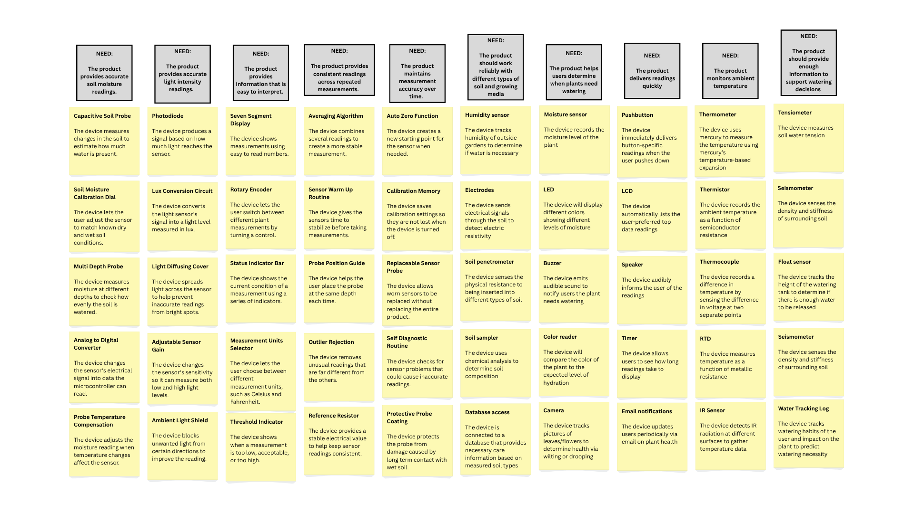{style="width:768px;"}
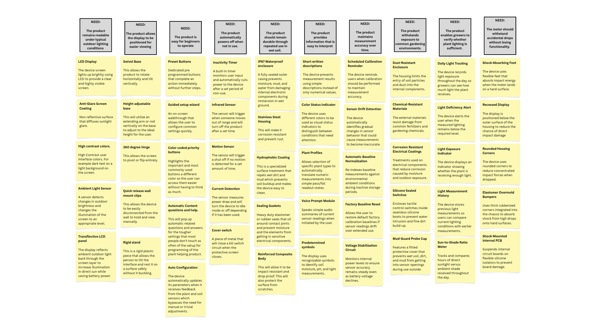{style="width:768px;"}
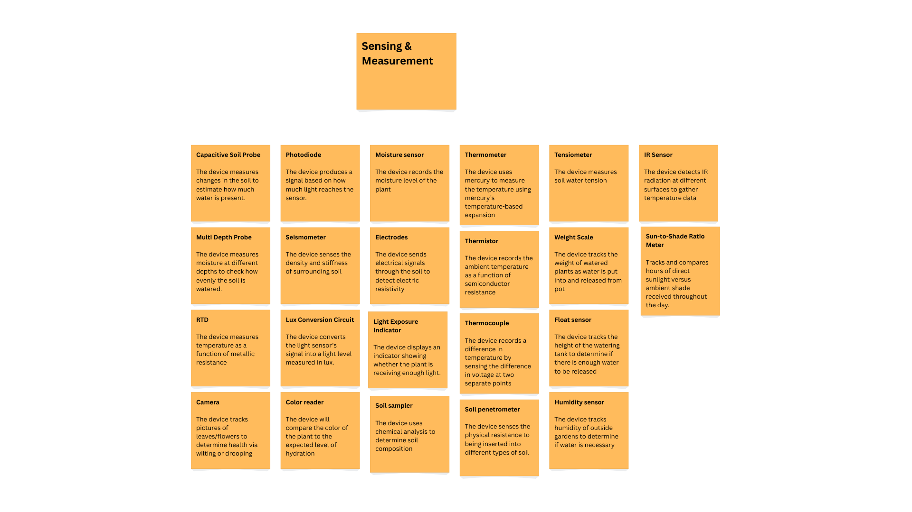{style="width:768px;"}
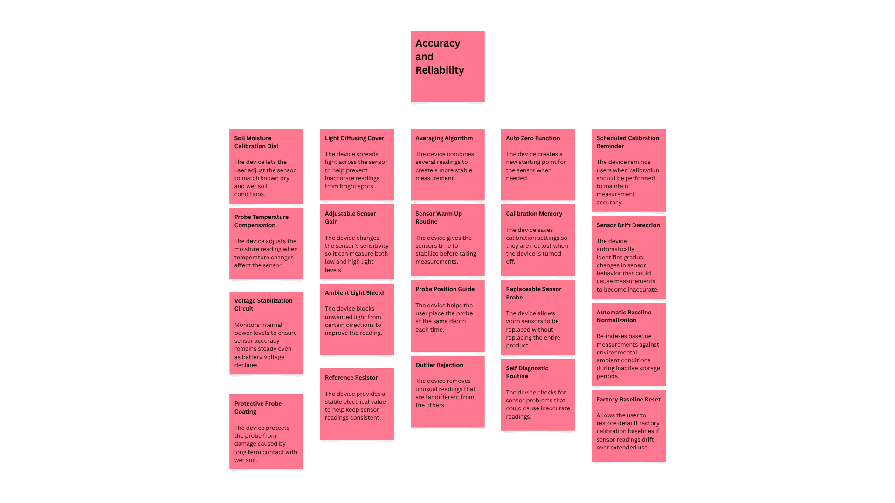{style="width:768px;"}
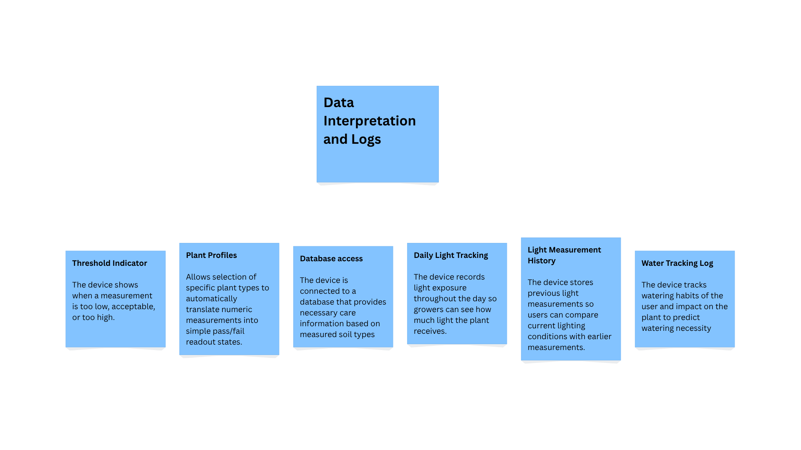{style="width:768px;"}
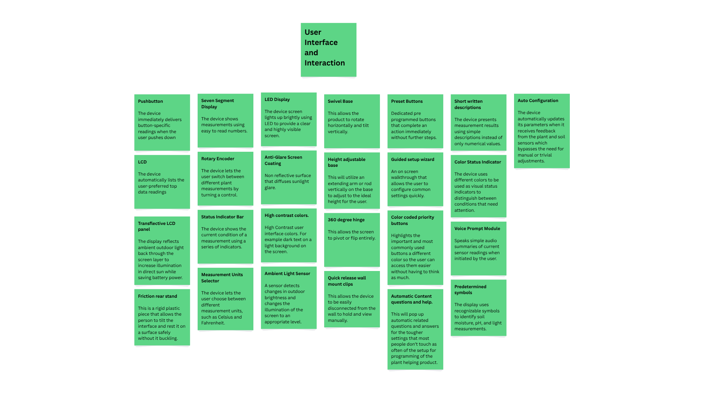{style="width:768px;"}
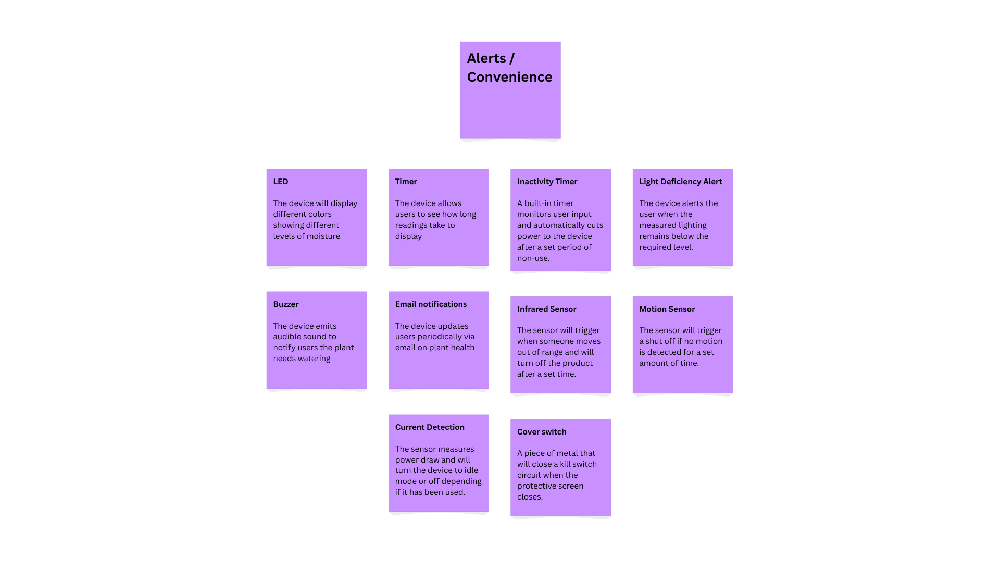{style="width:768px;"}
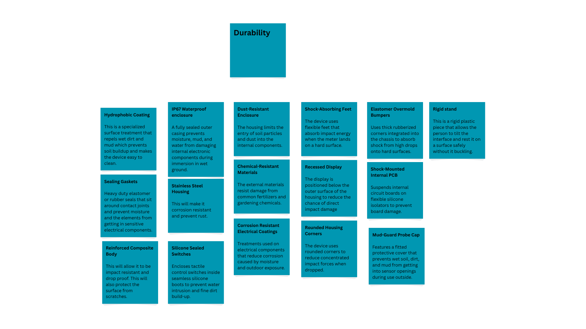{style="width:768px;"}
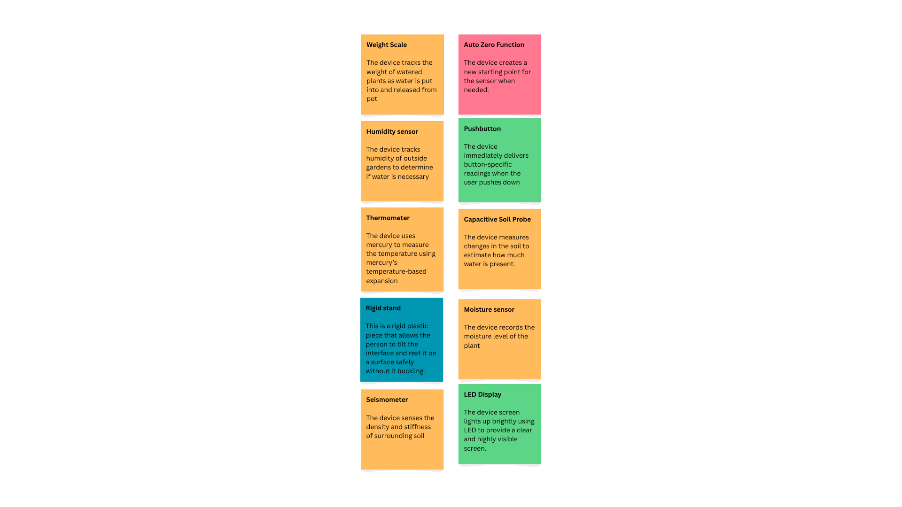{style="width:768px;"}

## Three Product Concept Sketches

**Product 1-**

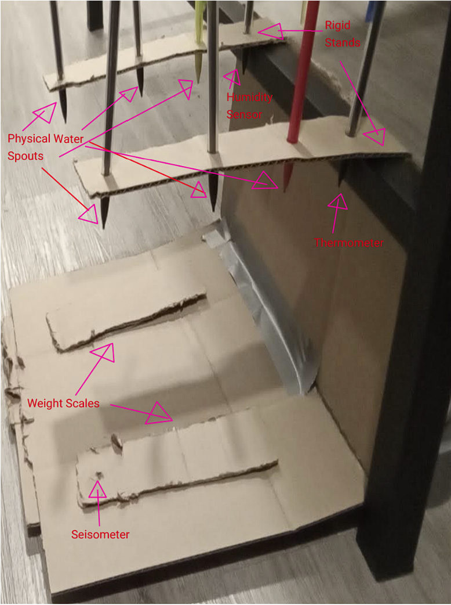{style="width:350px;"}

**Product 2-**

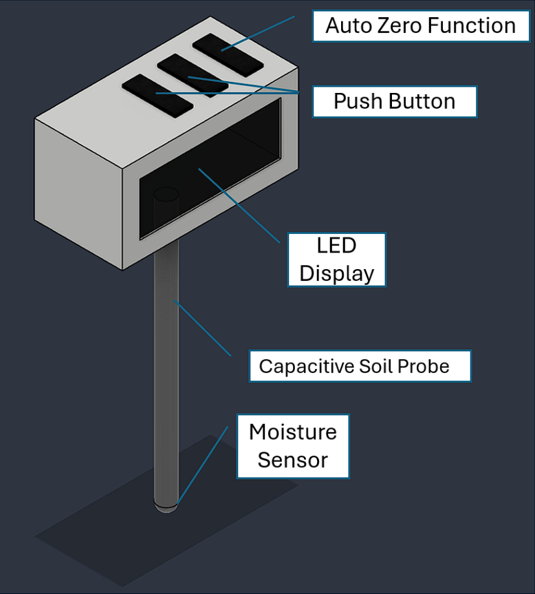{style="width:350px;"}

**Product 3-**

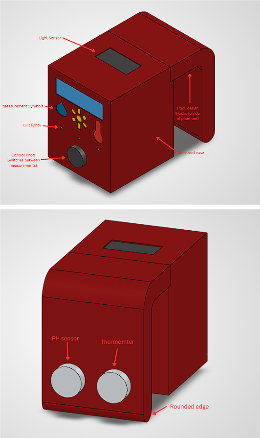{style="width:350px;"}

## Documentation

Our brainstorm session started during class where we each discussed how we wanted to approach the assignment. We decided the best way to start was by slightly modifying one of the brainstorming techniques, brainwriting. Brainwriting is where each person writes down an idea they have, and they pass it on to the next person who builds on that idea which is then passed onto the next person and so on. Our team liked the general idea, but decided in order to better match our schedules we would each split up the top user needs and come up with ideas on our own to share with the group. Everyone in the team participated in the initial meeting to decide who was to do what, and each group member equally contributed with their assigned parts.
In order to determine where the team should look for the most important problems to solve, it was determined that the ranked portion of the User Needs and Benchmarking assignment would be the best place to start. The team members went down the list selecting from the top of the rankings, knowing that those were determined to be crucial to the consumer. In some instances, lower ranked items were chosen over higher ranked ones because some items were able to give more creative freedom to ideate rather than just filling out the obvious solution. The group also determined that it would be best to look at the different groupings made so a wide variety of needs could be addressed. After that, each team member had their items and got to work.
Team members found ideas from sources including the benchmarking products, talking with friends, google searches for similar products, inspiration from the natural world, and good old-fashioned eureka moments. To collect ideas, the team members used the whiteboard feature in Canva, where one can create a sticky note with their idea and place it under the heading with the problem statement. This way, each member could add any idea that popped into their head at any time, as well as viewing in real time the progress of others. It was the ability to sit with many options already laid out that allowed true creativity to flow, building on ideas without getting hung up on the details. Additionally, by allowing some independent time between the first meeting and the first phase of brainstorming, members didn’t feel pressured to defend their ideas and could work at their own pace, coming up with ideas as fast or as methodical as necessary. 
Another technique that we used was the concept of question storming, where a group sets out to answer a statement instead of a question, writes down ideas individually, and sorts the results. While naturally built-in to the assignment, the team nevertheless found it very useful for the purposes of generating ideas without reservation. 
 After this initial phase, the group then discussed the ideas they came up with virtually. Each member of the group was given the opportunity to share their ideas with the rest, and explained their reasoning throughout their process. During this discussion, each team member did a very good job explaining their ideas, and when posed with a question about their features were able to defend it convincingly. Surprisingly, the only updates to the ideas at that point were formatting/grammar, indicating that it was a strong choice. 
Items were grouped in a similar fashion to how previous assignments were handled, by function and form. The main groups were separated into different experiences with the product, such as UI, alerts, sensing/measurement, durability, etc. This was where the most input was directed, as each member gave arguments and posed questions into how the groups should be arranged, which cleared up how we thought about our features as it relates to a finished product.
To rank items, it was clear that some ideas and thoughts reoccurred throughout the different groups, and it was decided that these were the most important ideas. We also noticed that some of our top ranked needs showed up more often than others, as well as common features that almost all other similar products had as well. The more familiar a feature was, the more likely it was to be important. Finally, with all the rankings determined, the team split up to fulfill as many as possible into the individual designs.

## Other Documentation

**Individual**
Troy-
I came up with my product idea from an overall standpoint of the plant sensor idea we are working on. After overlooking all of the features and needs that we as a team decided to use for our final product, I was able to pick out a select few that seemed to be the most important for my iteration of our product.
Carlos-
When thinking up my product idea, the first thought that came to mind was hanging it on the side of the pot plant so it was out of the line of fire of water when it was being watered. I also wanted my design to include a way to measure light levels and maintain a database of that information. I also wanted to focus on having a device that was built tough to resist liquid, dust, and corrosion.
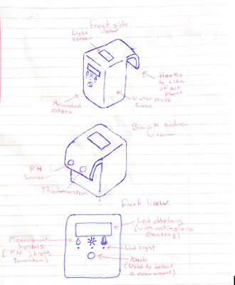{style="width:350px;"}

**Team**
During class on 9/23 we spoke about our 100 features that were derived from 20 of our main product ideas. We decided upon the main 3 products that we wanted to create preliminary designs for, this includes the irrigation system, and two possible iterations of the plant sensor. Over the next couple days the team split up and worked on our own drawings, information documentation, and models.
